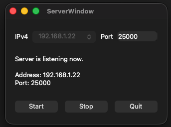

# Qt TCP Server Application

This project is a C++ TCP Server built using the Qt framework. It features a graphical user interface (GUI) for easy configuration and management. The server is designed to handle multiple client connections simultaneously, broadcast messages among clients, and maintain connection health using a custom heartbeat mechanism and a structured packet protocol.


<div align="center">
    
    <p><em>image: server GUI</em></p>
</div>


## Features
* **Graphical User Interface (GUI):** A clean interface (`ServerWindow`) that automatically detects available IPv4 addresses, allowing users to select an IP, input a port number, and easily Start, Stop, or Quit the server.
* **Multi-Client Support:** Built on `QTcpServer` and `QTcpSocket`, it accepts and manages multiple incoming client connections.
* **Message Broadcasting:** Any standard message (non-heartbeat) received from a client is automatically broadcasted to all other connected clients.
* **Heartbeat Mechanism:** The server actively monitors client connections. It sends a heartbeat ping every 10 seconds. If a client fails to respond within 3 consecutive heartbeat cycles (30 seconds), the server automatically aborts and disconnects the socket to prevent stale connections.
* **Custom Packet Protocol:** Data is parsed using a robust custom binary header (`PacketHeader`) that distinguishes between internal server commands (like heartbeats) and actual payloads (like text or files).

## Tech Stack

* **Language**: C++
* **Framework**: Qt (Core, Gui, Widgets, Network)

## Project Structure

* `main.cpp`: Entry point of the application (currently configured to launch the `ServerWindow`).
* **Server Components**: `server.h/cpp`, `serverwindow.h/cpp/ui`, `clientsocket.h/cpp`
* **Client Components**: `clientwindow.h/cpp/ui`, `filesenderdialog.h/cpp/ui`
* **Shared Components**: `packetHeader.h`

## Network Protocol

The application uses a custom binary header (`PacketHeader`) attached to every transmission to ensure structured data exchange. 

```cpp
enum class ePacketType : quint8 {
    Heartbeat = 0,
    TextMessage,
    File
};

typedef struct PacketHeader {
    ePacketType packetType;               // Type of packet (Heartbeat, Text, File)
    quint32 packetSize;                   // Size of the payload following the header
    char senderNickName[17];              // Null-terminated sender name (Max 16 chars)
    char fileName[33];                    // Null-terminated file name (Max 32 chars)
} PacketHeader_t;
```

## How to Run
1. Open the project in **Qt Creator** or configure it via CMake/qmake depending on your build system.
2. Build and run the project.
3. In the application window, select your desired **IPv4 address** from the dropdown.
4. Input a valid **Port** number (e.g., `8080`).
5. Click **Start** to listen for incoming connections. The status label will update to reflect the running state.
6. Click **Stop** to gracefully disconnect all clients and halt the server.